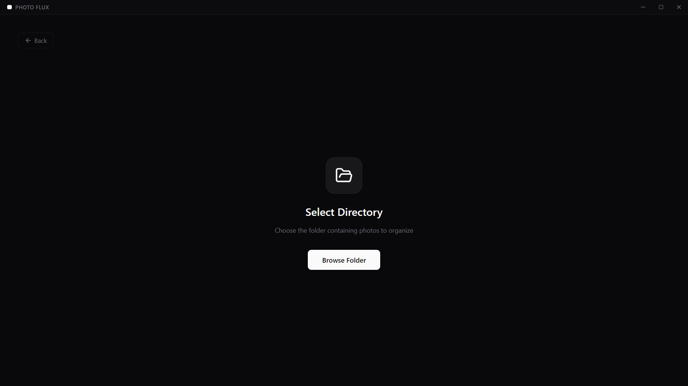
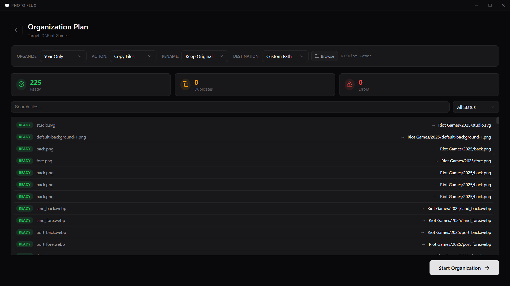
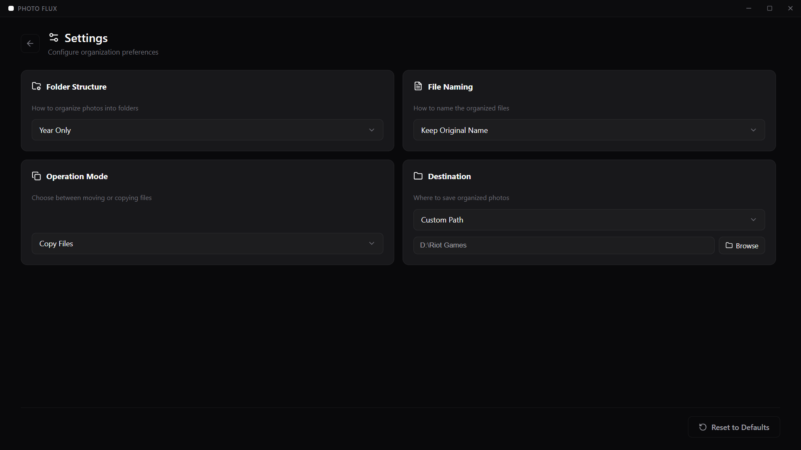

<h1 align="center">Photo Flux</h1>

<p align="center">
  <strong>Effortlessly organize your photo collections with intelligent metadata-based sorting</strong>
</p>

<p align="center">
  <a href="#-features">Features</a> •
  <a href="#-screenshots">Screenshots</a> •
  <a href="#-download">Download</a> •
  <a href="#-installation">Installation</a> •
  <a href="#-usage-guide">Usage Guide</a> •
  <a href="#-tech-stack">Tech Stack</a>
</p>

<p align="center">
  
  
  
  
  
</p>

## Download

### Latest Release: v1.1.0

| Download | Description |
|----------|-------------|
| [**Photo Flux Setup 1.1.0.exe**](https://github.com/divyviradiya1501/photo-flux/releases/download/v1.1.0/Photo.Flux.Setup.1.1.0.exe) | Windows installer with shortcuts |
| [**Photo Flux 1.1.0.exe**](https://github.com/divyviradiya1501/photo-flux/releases/download/v1.1.0/Photo.Flux.1.1.0.exe) | Portable version - no installation required |

### System Requirements

| Requirement | Minimum |
|-------------|---------|
| **Operating System** | Windows 10 or later |
| **RAM** | 2 GB |
| **Storage** | 200 MB for installation |
| **Additional** | No dependencies required |

---

## About

**Photo Flux** is a modern, offline Windows desktop application designed to organize your photo collections effortlessly. Built with Electron, React, and TypeScript, it scans your directories, reads EXIF metadata, and reorganizes your images into a structured timeline with smart duplicate detection and full revert capability.

### Why Photo Flux?

- **100% Offline** - Your photos never leave your computer
- **Non-Destructive** - Preview changes before execution, revert anytime
- **Smart Detection** - Uses EXIF metadata for accurate date-based organization
- **Beautiful UI** - Modern glassmorphism design with smooth animations

---

## Screenshots

### Dashboard
<p align="center">
  
</p>
<p align="center"><em>Clean, modern dashboard with quick access to all features</em></p>

### Scan View
<p align="center">
  
</p>
<p align="center"><em>Real-time scanning with live file discovery and progress tracking</em></p>

### Plan View
<p align="center">
  
</p>
<p align="center"><em>Review and customize your organization plan before execution</em></p>

### History view With Revert Option
<p align="center">
  
</p>


### Setting Screen
<p align="center">
  
</p>


---

## Features

### Core Functionality

| Feature | Description |
|---------|-------------|
| **Smart Scanning** | Recursively scans folders to detect all image files (JPG, JPEG, PNG, GIF, BMP, WEBP, TIFF, HEIC) |
| **EXIF Analysis** | Reads metadata to determine original capture date for accurate organization |
| **Duplicate Detection** | Automatically identifies and flags duplicate files before processing |
| **Conflict Resolution** | Detects naming conflicts and handles them gracefully |

### Organization Options

| Option | Choices | Description |
|--------|---------|-------------|
| **Folder Structure** | Year Only / Year & Month | `Photos/2024/` or `Photos/2024/January/` |
| **File Naming** | Keep Original / Date Prefix | `IMG_1234.jpg` or `2024-01-15_IMG_1234.jpg` |
| **Operation Mode** | Copy / Move | Keep originals or clean up source folder |
| **Destination** | Default Suffix / Custom Path | Create folder next to source or choose specific location |

### Safety Features

- **Preview Before Execute** - Review the complete organization plan before making any changes
- **Real-time Progress** - Watch files being processed with live status updates
- **Full Revert Capability** - Undo any organization operation and restore original state
- **Smart Cleanup** - Automatically removes empty folders after revert operations
- **Journal System** - Complete audit trail of all operations for accountability

### User Experience

- **Modern Glassmorphism UI** - Sleek, contemporary design with blur effects and smooth animations
- **Smooth Transitions** - Fluid page transitions and micro-interactions
- **Responsive Layout** - Adapts to different window sizes
- **Dark Theme** - Easy on the eyes, perfect for extended use
- **Silent Re-analysis** - Settings changes update instantly without interrupting workflow

---


## Installation

### Option 1: Installer (Recommended)

1. Download `Photo Flux Setup 1.1.0.exe` from the releases page
2. Run the installer
3. Choose installation directory (optional)
4. Launch from Desktop or Start Menu shortcut

### Option 2: Portable

1. Download `Photo Flux 1.1.0.exe` from the releases page
2. Run the executable directly - no installation needed
3. Perfect for USB drives or restricted environments

---

## Usage Guide

### Step 1: Start
Launch Photo Flux and click **"Start Organizing"** on the dashboard.

### Step 2: Select Source
Click **"Select Folder"** or drag & drop a folder containing your unorganized photos. The app will recursively scan all subfolders.

### Step 3: Review Scan Results
Watch as Photo Flux discovers your images in real-time. The scan shows:
- Total files found
- Supported image formats detected
- Folder structure being scanned

### Step 4: Configure Organization

| Setting | Options |
|---------|---------|
| **Organize by** | Year Only / Year & Month |
| **Rename files** | Keep Original / Add Date Prefix |
| **Operation** | Copy (safe) / Move (cleanup) |
| **Destination** | Default location / Custom folder |

### Step 5: Review Plan
Before execution, review the complete plan:
- **Ready** - Files ready for organization
- **Duplicate** - Identical files detected
- **Error** - Files with missing metadata

### Step 6: Execute
Click **"Start Organization"** and watch the progress:
- Circular progress indicator
- Real-time file processing status
- Success/error counters

### Step 7: Complete
After completion, you can:
- **View organized photos** - Open destination folder
- **Start new session** - Organize more photos
- **Revert changes** - Undo if needed

---

## Revert Feature

Made a mistake? No problem! Photo Flux keeps a complete journal of all operations.

1. Click **"Revert"** on the dashboard
2. Select the session to undo
3. Confirm the revert operation
4. All files return to their original locations
5. Empty folders are automatically cleaned up

---

## Tech Stack

| Technology | Purpose |
|------------|---------|
| [**Electron**](https://www.electronjs.org/) | Cross-platform desktop framework |
| [**React 18**](https://react.dev/) | UI component library |
| [**TypeScript**](https://www.typescriptlang.org/) | Type-safe JavaScript |
| [**Electron-Vite**](https://electron-vite.org/) | Fast build tooling |
| [**exifr**](https://github.com/MikeKovarik/exifr) | EXIF metadata parsing |
| [**Lucide React**](https://lucide.dev/) | Beautiful icon set |
| [**UUID**](https://github.com/uuidjs/uuid) | Unique session identifiers |

---

## Development

### Prerequisites

- [Node.js](https://nodejs.org/) v18 or higher
- [npm](https://www.npmjs.com/) (comes with Node.js)

### Setup

```bash
# Clone the repository
git clone https://github.com/divyviradiya1501/photo-flux.git
cd photo-flux

# Install dependencies
npm install

# Run in development mode
npm run dev
```

### Build Commands

```bash
# Build for production
npm run build

# Create Windows installer
npm run build:win

# Preview production build
npm run preview
```

### Output

After running `npm run build:win`, find your files in the `dist` folder:
- `Photo Flux Setup x.x.x.exe` - NSIS installer
- `Photo Flux x.x.x.exe` - Portable executable
- `win-unpacked/` - Unpacked application

---

## Project Structure

```
photo-flux/
├── build/                    # App icons and build resources
├── screenshots/              # Application screenshots
├── src/
│   ├── main/                 # Electron main process
│   │   ├── index.ts          # Main entry point
│   │   └── services/         # Backend services
│   │       ├── fileOps.ts    # File operations
│   │       ├── journal.ts    # Operation logging
│   │       └── revert.ts     # Revert functionality
│   ├── preload/              # IPC bridge
│   │   └── index.ts          # Preload scripts
│   └── renderer/             # React frontend
│       ├── src/
│       │   ├── components/   # View components
│       │   │   ├── Dashboard.tsx
│       │   │   ├── ScanView.tsx
│       │   │   ├── PlanView.tsx
│       │   │   ├── ExecuteView.tsx
│       │   │   ├── SettingsView.tsx
│       │   │   └── RevertView.tsx
│       │   ├── contexts/     # React contexts
│       │   ├── assets/       # Styles and assets
│       │   └── App.tsx       # Main application
│       └── index.html        # Entry HTML
├── electron.vite.config.ts   # Vite configuration
├── tsconfig.json             # TypeScript config
└── package.json              # Dependencies and scripts
```

---

## Supported Formats

| Format | Extension |
|--------|-----------|
| JPEG | `.jpg`, `.jpeg` |
| PNG | `.png` |
| GIF | `.gif` |
| BMP | `.bmp` |
| WebP | `.webp` |
| TIFF | `.tiff`, `.tif` |
| HEIC | `.heic` |

---

## Changelog

### v1.1.0 (Latest)
- Redesigned Settings page with 2x2 grid layout
- Silent re-analysis when changing options
- Custom path display next to Browse button
- Smart folder cleanup on revert
- Fixed success/error count accuracy
- Fixed duplicate event handling
- Improved state management

### v1.0.0
- Initial release
- Core scanning and organization
- EXIF metadata analysis
- Copy/Move operations
- Revert capability
- Modern glassmorphism UI

---

## License

Distributed under the **MIT License**. See [LICENSE](LICENSE) for more information.

---

## Author

**Photo Flux Team**

- GitHub: [@divyviradiya1501](https://github.com/divyviradiya1501)

---

<p align="center">
  <strong>Made with ❤️ for photographers everywhere</strong>
</p>

<p align="center">
  <a href="https://github.com/divyviradiya1501/photo-flux/issues">Report Bug</a> •
  <a href="https://github.com/divyviradiya1501/photo-flux/issues">Request Feature</a>
</p>
