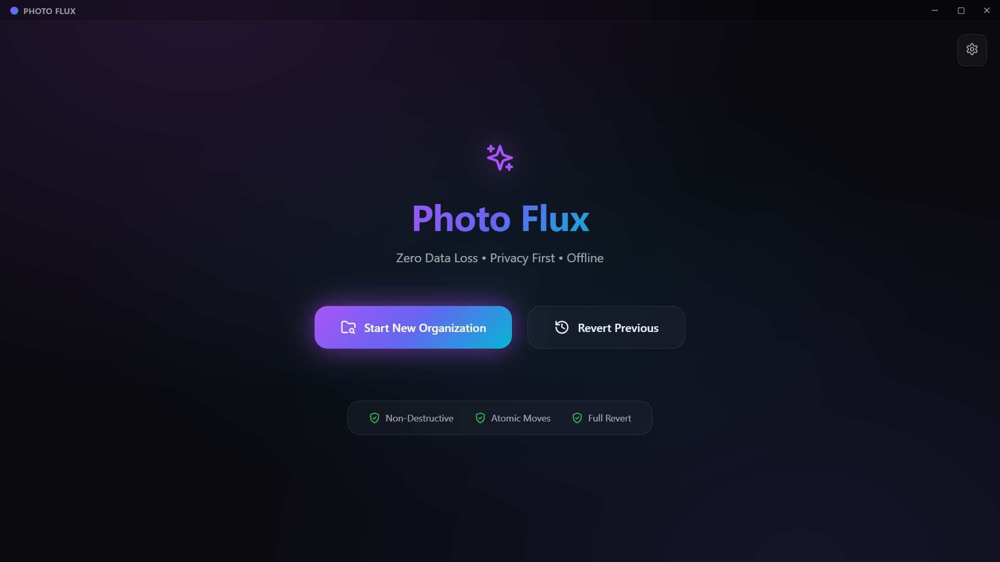

# Photo Flux

**Photo Flux** is a modern, offline Windows desktop application designed to organize your photo collections effortlessly. Built with Electron, React, and TypeScript, it scans your directories, reads EXIF metadata, and reorganizes your images into a structured timeline (Year/Month) with options to rename and sort safely.


*(Replace the link above with a screenshot of your application if available)*

## 📥 Download

Get the latest Windows installer from the official Releases page.

📥[Download Photo Flux](https://github.com/divyviradiya1501/photo-flux/releases/download/v1.0.0/Photo.Flux.Setup.1.0.0.exe)

1. Click the button above or visit the [**Latest Release**](https://github.com/divyviradiya1501/photo-flux/releases/latest) page.
2. Scroll down to the **Assets** section.
3. Click on the Setup file (e.g., `Photo.Flux.Setup.1.0.0.exe`) to download.

## 🚀 Features

* **Smart Scanning**: Recursively scans folders to detect image files.
* **Metadata Analysis**: Reads EXIF data to determine the original capture date of photos.
* **Flexible Organization**:
    * **Group by**: Year Only or Year & Month.
    * **Action**: Copy files (safe mode) or Move files (cleanup mode).
    * **Renaming**: Keep original filenames or prepend the capture date (e.g., `2023-12-25_IMG001.jpg`).
* **Review Plan**: Preview the organization plan, detect duplicates, and identify conflicts before executing.
* **Safe Execution**: Real-time progress tracking with a summary of successes and failures.
* **Revert Capability**: Undo the last organization operation if you change your mind.
* **Modern UI**: Features a sleek, "glassmorphism" design with smooth page transitions and animations.

## 🛠️ Tech Stack

* **Core**: [Electron](https://www.electronjs.org/)
* **Frontend**: [React](https://react.dev/) + [TypeScript](https://www.typescriptlang.org/)
* **Build Tool**: [Electron-Vite](https://electron-vite.org/)
* **Styling**: CSS Modules (Glassmorphism effects)
* **Icons**: [Lucide React](https://lucide.dev/)
* **Metadata**: [exifr](https://github.com/MikeKovarik/exifr)

## 📋 Prerequisites

Before you begin, ensure you have the following installed on your machine:
* [Node.js](https://nodejs.org/) (v18 or higher recommended)
* [npm](https://www.npmjs.com/) (usually comes with Node.js)

## 💻 Getting Started

Follow these steps to set up the project locally.

### 1. Clone the Repository
```bash
git clone [https://github.com/divyviradiya1501/photo-flux.git](https://github.com/divyviradiya1501/photo-flux.git)
cd photo-flux
```

### 2. Install Dependencies
Install the required node modules defined in package.json.
```bash
npm install
```
Here is the full, formatted Markdown code for your README.md file. You can copy the block below directly into your file.

Markdown


### 3. Run in Development Mode
Start the Electron app with hot-reload enabled for both the Main and Renderer processes.

```Bash

npm run dev
```

## 📦 Building and Distribution
To create a production-ready application or an installer for Windows.

Build for Production
Compiles the source code into the out directory.

```Bash

npm run build
```

## Create Windows Installer
This command builds the project and packs it into a Windows installer (.exe) and a portable executable.

```Bash

npm run build:win
```

The output files will be located in the dist folder.

Preview Production Build
Preview the built application before packaging.

```Bash

npm run preview
```

## 📖 Usage Guide
1. Dashboard: Click "Start" to begin.

2. Scan: Select a source folder containing your unorganized photos. The app will recursively find all supported image formats.

3. Plan:

        Choose your Organization Mode (Year or Year/Month).

        Select a Destination (Default suffix or Custom folder).

        Choose Action (Move or Copy).

        Review the file list for "Ready", "Duplicate", or "Error" statuses.

4. Execute: Click "Start Organization" to process the files. Watch the circular progress bar as files are processed.

5. Finish: Once done, you can view the results or go to the Revert view to undo the changes.

## 📂 Project Structure

```Bash
photo-flux/
├── build/               # Icons and build resources
├── src/
│   ├── main/            # Electron main process (Node.js)
│   ├── preload/         # Preload scripts (IPC bridge)
│   └── renderer/        # React frontend application
│       ├── components/  # View components (Dashboard, ScanView, PlanView, etc.)
│       ├── assets/      # CSS and global assets
│       └── App.tsx      # Main application router/layout
├── electron.vite.config.ts  # Vite configuration
└── package.json         # Project dependencies and scripts
```

## 📄 License
Distributed under the MIT License. See LICENSE for more information.

## 👤 Author
Photo Flux Team

GitHub: [divyviradiya](https://github.com/divyviradiya1501)
